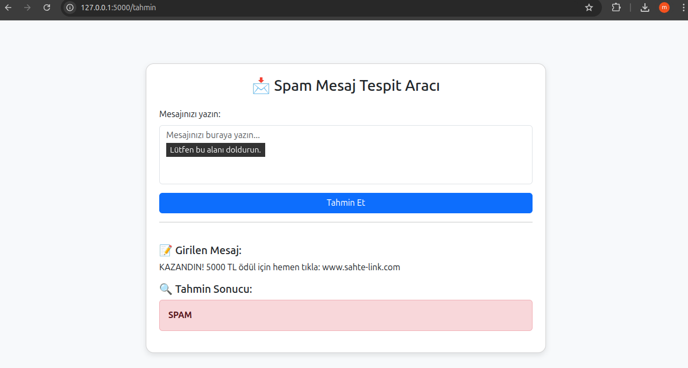
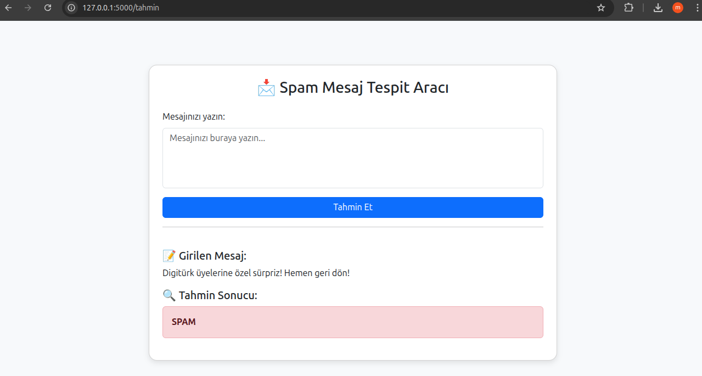
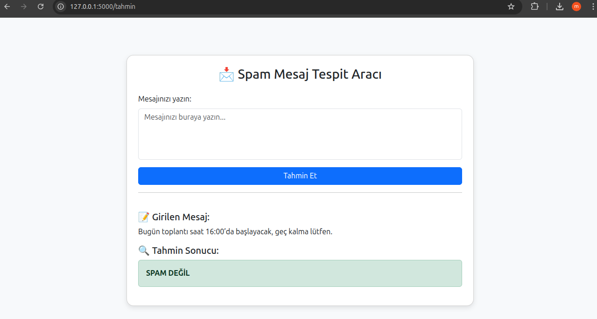

# 📬 Turkish SMS Spam Detection API

A simple but powerful machine learning project built using Python, Flask, and scikit-learn to classify Turkish SMS messages as **spam** or **not spam**. The model is trained with real Turkish SMS data and exposes a REST API to classify custom text inputs.

---

## 🚀 Features

- 🔤 Turkish NLP pipeline with stopword removal and TF-IDF vectorization
- 🤖 Trained Naive Bayes classifier with ~96% accuracy
- 🌐 REST API with Flask
- 📱 Responsive web frontend (HTML/CSS/Bootstrap)
- 📦 Model and vectorizer saving & loading with `joblib`

---

## 🛠️ Technologies Used

- Python 3.x
- Flask
- scikit-learn
- pandas
- nltk
- HTML + Bootstrap (Frontend)

---

## 🧠 Model Performance

| Metric     | Score  |
|------------|--------|
| Accuracy   | 96.5%  |
| Precision  | 96-98% |
| F1-score   | 96-97% |

The model performs well on both spam and non-spam classes with high precision and recall values.

---

## 📸 Sample Predictions (Screenshots)

### 🟥 Spam Predictions

| Example 1 | Example 2 |
|-----------|-----------|
|  |  |

---

### 🟩 Non-Spam Predictions

| Example 1 | Example 2 |
|-----------|-----------|
|  |  |


## 📦 Installation & Run Locally

```bash
# Clone this repo
git clone https://github.com/mustafaaesen/spam-tespit-api.git
cd spam-tespit-api

# Create virtual environment
python -m venv venv
source venv/bin/activate  # On Windows: venv\Scripts\activate

# Install dependencies
pip install -r requirements.txt

# Run the app
python app.py

Then open your browser and navigate to:
👉 http://127.0.0.1:5000/
